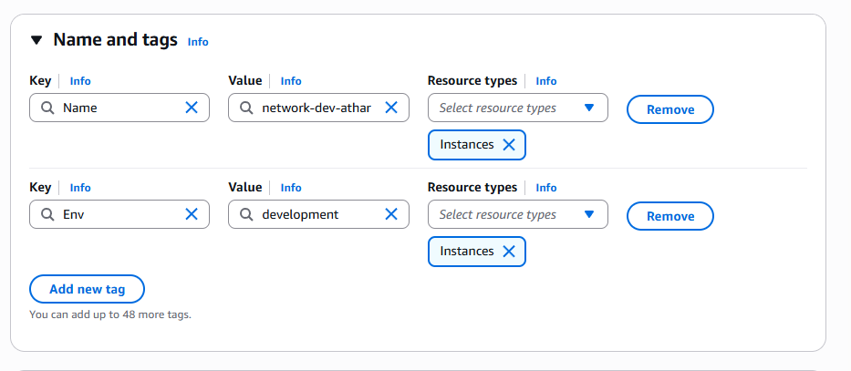
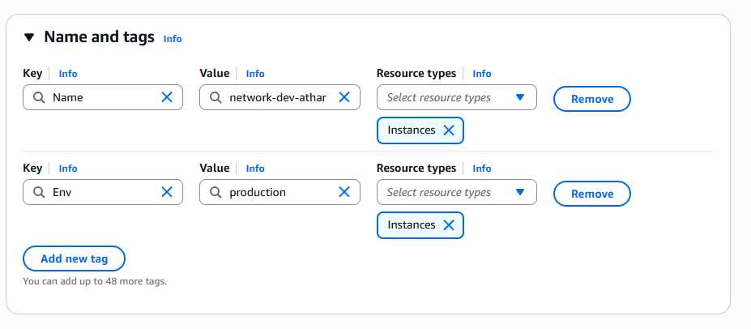
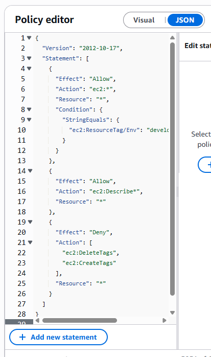
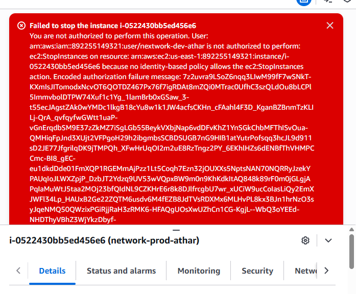

# AWS IAM & EC2 Security Project

**Author:** MOHAMMAD ATHAR SHAREEF

**Purpose:** Demonstrate environment-based access control in AWS using IAM policies, EC2, and resource tagging.

---

## Project Overview
This project shows how to:
- Launch EC2 instances for **production** and **development**
- Create an IAM policy that grants EC2 actions only for instances tagged `Env=development`
- Create IAM group and user, attach the policy, and verify access via IAM Policy Simulator and console tests

---

## Architecture & Services Used 
- Amazon EC2 (compute instances)
- AWS IAM (policies, users, groups)
- IAM Policy Simulator (testing)
- AWS Account Alias (friendly sign-in URL)

---

## Files in this Repo
- `policy/NextWorkDevEnvironmentPolicy.json` — IAM policy used in this project  
- `images/` — screenshots from the AWS Console
  
## 📄 Full Report
- `report/AWS-IAM-EC2-Project-Report.pdf`
- `README.md` — this file

---

## Policy (summary)
The policy allows `ec2:*` for resources tagged `Env=development`, allows `ec2:Describe*` globally, and denies tag edits (`ec2:CreateTags`, `ec2:DeleteTags`).

Example policy JSON is in `policy/NextWorkDevEnvironmentPolicy.json`.

---

## Steps to Reproduce
1. Create two EC2 instances and tag them:
   - `Env=production` (name: `nextwork-prod-...`)
   - `Env=development` (name: `nextwork-dev-...`)
2. Create IAM policy from the JSON in `policy/`
3. Create group `nextwork-dev-group`; attach the policy
4. Create user `nextwork-dev-...` and add to the group
5. Use the IAM Policy Simulator or login as the user to confirm:
   - Dev instance: start/stop allowed
   - Prod instance: start/stop denied

---

## Screenshots
### 📸 Screenshots

**1. AWS Account Alias Creation**

**2. Development Instance Tagging**

**3. Production Instance Tagging**

**4. IAM Policy JSON**

**5. IAM User Creation**

**6. Production Instance Stop Attempt (Access Denied)**

**7. Development Instance Stopped (Access Allowed)**

---

| Category | Details |
|-----------|----------|
| **Project Type** | Cloud Security (AWS IAM + EC2) |
| **Skills Covered** | IAM, EC2 Security Groups, MFA, Key Pair Management |
| **Cloud Platform** | Amazon Web Services (Free Tier) |
| **Time Taken** | ~2 days |
| **Outcome** | Implemented secure access controls and instance-level protection |

---

## Results & Findings
- IAM policies successfully restricted unauthorized S3 access.
- MFA implementation added an extra layer of authentication.
- Security Groups blocked external traffic except SSH (22) and HTTPS (443).
- Verified access logs in CloudTrail for auditing.

---

## Learnings
- Implemented least privilege with IAM tag-based policies  
- Verified policy behavior using the IAM Policy Simulator  
- Separated dev and prod access to prevent accidental changes
-  Strengthened understanding of **role-based access control (RBAC)** in cloud environments

---

## License
This project is licensed under the MIT License. See `LICENSE` for details.

## 📬 Contact
📧 **Email:** athar2196@gmail.com  
🌐 **GitHub:** [atharshareef7](https://github.com/atharshareef7) 
💼 **LinkedIn:** [Mohammad Athar Shareef](https://www.linkedin.com/in/mohammad-athar-shareef-09181523a/)

---
